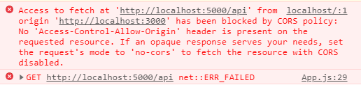

# front ↔ backend

## CORS
초기 환경 설정할 때 프론트엔드와 백엔드를 연결하기 위해 간단한 데이터 전송을 예시로 만들었는데 CORS issue 나타났다.
결론부터 말하면 백엔드 부분에 CORS 라이브러리를 설치하여 해결했다.
### console.log 창


```javascript
// /server/app.js
const cors = require('cors');
// ...
app.use(cors());
```
미들웨어로 CORS를 설치하니 오류 창이 사라졌다. 

## nodemon / concurrently
개발을 조금 더 편하게 하기 위해 nodemon과 concurrently를 활용했다.
- nodemon: 파일이 변경돼도 자동으로 랜더링 해주는 도구
- concurrently: frontend와 backend를 동시에 실행시켜주는 도구
