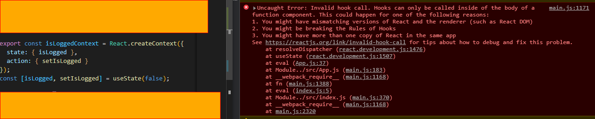

# useContext 값 변경

## 문제 상황

로그인 유지기능을 구현하기 위해 ContextAPI를 사용했다.
로그인 유지를 하려면

1. 페이지 이동시 로컬스토리지에 있는 JWT토큰을 서버에 넘겨준다.
2. JWT검증을 확인하다.
3. 검증이 성공하면 다음페이지로 이동, 검증이 실패하면 로그인페이지로 이동한다.  
   나는 ContextAPI를 사용해서 `false`값이면 로그인 페이지 `true`면 홈페이지로 이동을 구현하려 했다. 값을 변경하기 위해 useState를 사용해서 setState로 값을 변경해 주려고 했다. 하지만 이와 같은 오류가 나왔다.



## 문제해결

React 공식 홈페이지나 코드를 지웠다 실행한 결과 hook 규칙에 위배된다고 생각이 들었다. 그래서 ContextAPI공부를 하다 보니 `Provider 컴포넌트`를 따로 만들어 `Context 값을 가져오는` 것을 확인하게 됐다. 그리고 Context 값을 `변경`하기 위해 구글링을 해보니 `useReducer hook`을 사용하는 방법을 알게 됐다.  
출처에서 보고 따라 하면서 ContextAPI의 활용을 연습해봤고 `reducer 함수` 구현하는 것이 힘들었지만 한번 구현하고 나면 `재사용성이 쉽다`는 것을 느끼게 됐다.

### isLoggedContext컴포넌트

```javascript
import React, { useReducer } from "react";
import { LOGIN, LOGOUT } from "./actionType";

const initailState = { isLogged: false };

const isLoggedContext = React.createContext();
//reducer함수 구현 익숙하지않아 어렵다..
const reducer = (state = initailState, action) => {
  switch (action.type) {
    case LOGIN:
      return { isLogged: true };
    case LOGOUT:
      return { isLogged: false };
    default:
      return state;
  }
};

const Provider = ({ children }) => {
  const [state, dispatch] = useReducer(reducer, initailState);
  const value = { state, dispatch };
  return (
    <isLoggedContext.Provider value={value}>
      {children}
    </isLoggedContext.Provider>
  );
};

export { isLoggedContext, Provider };
```

### 인증관련 컴포넌트 중 dispatch활용 하는 부분

```javascript
const {
  state: { isLogged },
  dispatch,
} = useContext(isLoggedContext);
console.log(isLogged);

useEffect(async () => {
  try {
    const authCode = location.search.slice(6);
    const bodyData = { authCode };
    const tmp = await requestPOST(`${API_ENDPOINT}/login/auth`, bodyData);
    const data = await tmp.json();
    //로그인 상태로 바꿔줌
    dispatch({ type: LOGIN });
    localStorage.setItem("user", data.user);
  } catch {
    console.log("Auth: ", console.log(e));
  }
}, []);
```

다음에 상태 관리를 위해 ContextAPI를 사용한다면 혼자서 구현해 볼 것이다.

> **출처**  
> https://codingbroker.tistory.com/125
